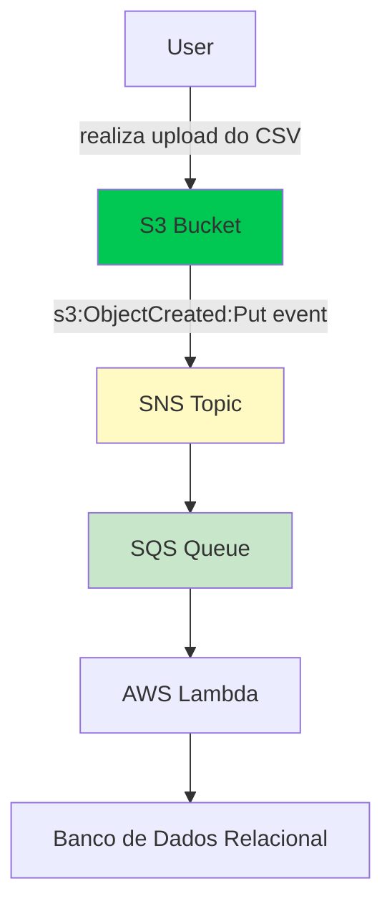

# Arquitetura do Projeto
Para a escolha de arquitetura, utilizei o padrão command-handler, de forma a implementar os comandos baseados no padrão CQRS (Command Query Responsibility Segregation).


```
[User] --realiza upload do CSV---> [1. S3 Bucket]
                               |
                               | (s3:ObjectCreated:Put event)
                               v
                       [2. tópico do SNS]  (via Fan-out)
                        /         \
                       /           \ 
                      v             v
 (pcrs. principal) [3.fila do SQS]    [Outros serviços]
                      |              (e.g., loggers, alertas de e-mail)
                      | (aciona Lambda)
                      v
             [4. AWS Lambda]
             (Contém lógica de processamento)
             - Recebe evento do SQS
             - Lê o bucket do S3 com dados
             - Faz download do CSV do S3
             - Resume os dados com Pandas
             - Conecta ao banco de dados
             - Escreve os dados resumidos
                      |
                      v
           [5. Banco de Dados Relacional]
           (e.g., AWSD RDS com PostgreSQL)
```



## Diagrama de Arquitetura
[#Arquitetura do Projeto](./docs/arquitetura.png)

## IaC
Para a criação dos recursos na nuvem, utilizei duas ferramentas de Infraestrutura como Código (IaC):
 - **Terraform**: para criar os recursos do AWS S3, SNS, SQS e IAM.
 - **AWS SAM**: para criar os recursos do AWS Lambda e o banco de dados PostgreSQL no AWS RDS.
 - **Localstack**: para simular os serviços da AWS localmente, como S3, SNS e SQS.
 - **Docker**: para executar o PostgreSQL em um container localmente.


# Referências de estudo
 - https://github.com/aws-samples/aws-lambda-hexagonal-architecture?tab=readme-ov-file
 - https://docs.aws.amazon.com/pt_br/prescriptive-guidance/latest/patterns/structure-a-python-project-in-hexagonal-architecture-using-aws-lambda.html
 - https://aws.amazon.com/pt/blogs/compute/developing-evolutionary-architecture-with-aws-lambda/